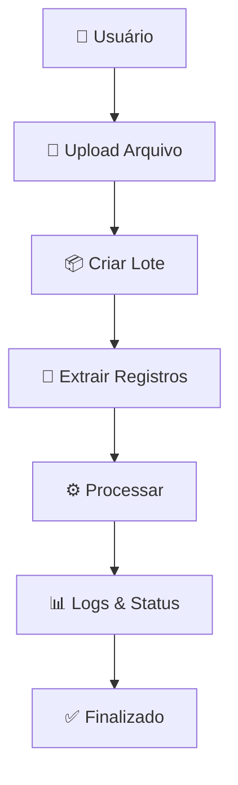

# 📘 HG08 — Modelo de Dados PostgreSQL
**Plataforma de Processamento PCL - Gráfica Ltda**

---

## 🎯 Descrição do Projeto

Projetar e implementar o modelo de dados completo que suportará o processamento, armazenamento e rastreabilidade dos arquivos de mala direta enviados pelos operadores da Gráfica Ltda.

### 🎯 **Objetivos Específicos**

- ✅ **Modelagem das entidades principais** do domínio de negócio
- ✅ **Relacionamentos necessários** para o fluxo de processamento  
- ✅ **Suporte completo** ao histórico de logs e rastreabilidade
- ✅ **Estrutura preparada** para evolução futura (API Key + Secret Key)

### 📋 **Critérios de Aceite**

| Critério | Status | Descrição |
|----------|--------|-----------|
| 📝 Script SQL | ✅ Concluído | Script inicial versionado e testado |
| 🗄️ Modelo ER | ✅ Validado | Diagrama revisado e aprovado |
| 🔗 Relacionamentos | ✅ Mapeados | Foreign keys e constraints definidas |
| 📊 Rastreabilidade | ✅ Implementada | Sistema completo de logs e auditoria |

---

## 🧱 Modelagem do Banco de Dados

### 📌 Visão Geral da Arquitetura

O banco de dados foi estruturado para atender completamente o fluxo operacional da **Gráfica Ltda**, onde usuários internos realizam upload de arquivos de mala direta enviados pelos clientes. Estes arquivos são processados pelo **Worker** e **Lambdas**, com armazenamento em **S3** e rastreabilidade completa por lote.

### 🏗️ **Entidades do Sistema**

| Entidade | Descrição | Responsabilidade |
|----------|-----------|------------------|
| 👥 **Usuários Internos** | Personas do sistema | Ana, Carlos e Marcos via portal web |
| 🏢 **Clientes** | Empresas atendidas | Representam os contratantes dos serviços |
| 📦 **Lotes** | Unidade de processamento | Cada importação de arquivo gera um lote |
| 📄 **Registros** | Dados individuais | Cada linha do arquivo vira um registro |
| ⚙️ **Processamento** | Controle operacional | Status detalhado, logs e auditoria |
| 🔑 **API Keys** | Evolução futura | Para API pública (não usado no MVP) |

### 🔄 **Fluxo de Dados**

---

## 🗄️ Diagrama Entidade-Relacionamento

### 📋 **Como Visualizar**

Para visualizar o diagrama ER, copie o código PlantUML abaixo e cole no **PlantUML Web Server**:

> 🌐 **Link:** <https://www.plantuml.com/plantuml/uml/>

### 🎨 **Código do Diagrama ER**

@startuml
!theme plain

entity "usuarios" {
  * id : serial <<PK>>
  --
  nome : varchar(100)
  email : varchar(150)
  senha_hash : varchar(200)
  perfil : varchar(50)
  ultimo_login : timestamp
  data_criacao : timestamp
}

entity "clientes" {
  * id : serial <<PK>>
  --
  nome : varchar(150)
  email : varchar(150)
  telefone : varchar(20)
  empresa : varchar(150)
  ativo : boolean
  data_criacao : timestamp
}

entity "perfis_processamento" {
  * id : serial <<PK>>
  --
  cliente_id : integer <<FK>>
  nome : varchar(100)
  descricao : text
  tipo_arquivo : varchar(20)
  delimitador : varchar(5)
  template_pcl : varchar(200)
  data_criacao : timestamp
}

entity "lotes_processamento" {
  * id : serial <<PK>>
  --
  cliente_id : integer <<FK>>
  usuario_id : integer <<FK>>
  perfil_processamento_id : integer <<FK>>
  nome_arquivo : varchar(200)
  caminho_s3 : varchar(300)
  status : varchar(50)
  data_criacao : timestamp
  data_processamento : timestamp
}

entity "lote_registros" {
  * id : serial <<PK>>
  --
  lote_id : integer <<FK>>
  nome : varchar(200)
  endereco : varchar(300)
  bairro : varchar(100)
  cidade : varchar(100)
  uf : varchar(2)
  cep : varchar(20)
}

entity "processamento_logs" {
  * id : serial <<PK>>
  --
  lote_id : integer <<FK>>
  mensagem : text
  tipo : varchar(20)
  data_criacao : timestamp
}

entity "credenciais_api_clientes" {
  * id : serial <<PK>>
  --
  cliente_id : integer <<FK>>
  api_key : varchar(200)
  secret_key : varchar(200)
  ativo : boolean
  data_criacao : timestamp
}

usuarios ||--o{ lotes_processamento : inicia >
clientes ||--o{ lotes_processamento : pertence >
clientes ||--o{ perfis_processamento : possui >
perfis_processamento ||--o{ lotes_processamento : usa >
lotes_processamento ||--o{ lote_registros : contém >
lotes_processamento ||--o{ processamento_logs : gera >
clientes ||--o{ credenciais_api_clientes : possui >

@enduml

---

## 🧩 Script SQL de Criação

### 🚀 **Implementação PostgreSQL**

Script completo pronto para versionamento via **EF Core Migrations** ou execução direta no banco.

#### 🛠️ **Características Técnicas**

- ✅ **IDs Sequenciais (SERIAL)** para melhor performance e simplicidade
- ✅ **Constraints** de integridade referencial
- ✅ **Indexes** implícitos nas foreign keys
- ✅ **Timestamps** automáticos para auditoria
- ✅ **Cascade deletes** para limpeza automática

### 📝 **Script de Criação**

-- Tabelas principais com IDs inteiros sequenciais
CREATE TABLE usuarios (
    id SERIAL PRIMARY KEY,
    nome VARCHAR(100) NOT NULL,
    email VARCHAR(150) UNIQUE NOT NULL,
    senha_hash VARCHAR(200) NOT NULL,
    perfil VARCHAR(50) NOT NULL,
    ultimo_login TIMESTAMP,
    data_criacao TIMESTAMP DEFAULT NOW()
);

CREATE TABLE clientes (
    id SERIAL PRIMARY KEY,
    nome VARCHAR(150) NOT NULL,
    email VARCHAR(150) NOT NULL,
    telefone VARCHAR(20),
    empresa VARCHAR(150),
    ativo BOOLEAN DEFAULT TRUE,
    data_criacao TIMESTAMP DEFAULT NOW()
);

CREATE TABLE perfis_processamento (
    id SERIAL PRIMARY KEY,
    cliente_id INTEGER NOT NULL REFERENCES clientes(id),
    nome VARCHAR(100) NOT NULL,
    descricao TEXT,
    tipo_arquivo VARCHAR(20),
    delimitador VARCHAR(5),
    template_pcl VARCHAR(200),
    data_criacao TIMESTAMP DEFAULT NOW()
);

CREATE TABLE lotes_processamento (
    id SERIAL PRIMARY KEY,
    cliente_id INTEGER NOT NULL REFERENCES clientes(id),
    usuario_id INTEGER NOT NULL REFERENCES usuarios(id),
    perfil_processamento_id INTEGER NOT NULL REFERENCES perfis_processamento(id),
    nome_arquivo VARCHAR(200) NOT NULL,
    caminho_s3 VARCHAR(300) NOT NULL,
    status VARCHAR(50) NOT NULL,
    data_criacao TIMESTAMP DEFAULT NOW(),
    data_processamento TIMESTAMP
);

CREATE TABLE lote_registros (
    id SERIAL PRIMARY KEY,
    lote_id INTEGER NOT NULL REFERENCES lotes_processamento(id) ON DELETE CASCADE,
    nome VARCHAR(200),
    endereco VARCHAR(300),
    bairro VARCHAR(100),
    cidade VARCHAR(100),
    uf VARCHAR(2),
    cep VARCHAR(20)
);

CREATE TABLE processamento_logs (
    id SERIAL PRIMARY KEY,
    lote_id INTEGER NOT NULL REFERENCES lotes_processamento(id) ON DELETE CASCADE,
    mensagem TEXT,
    tipo VARCHAR(20),
    data_criacao TIMESTAMP DEFAULT NOW()
);

CREATE TABLE credenciais_api_clientes (
    id SERIAL PRIMARY KEY,
    cliente_id INTEGER NOT NULL REFERENCES clientes(id),
    api_key VARCHAR(200),
    secret_key VARCHAR(200),
    ativo BOOLEAN DEFAULT TRUE,
    data_criacao TIMESTAMP DEFAULT NOW()
);

---

## 📦 Estrutura Final das Entidades

### 🏗️ **Organização por Domínio**

#### 👥 **Dados Básicos**

- `usuarios` - Operadores internos do sistema
- `clientes` - Empresas contratantes dos serviços

#### ⚙️ **Processamento de Dados**

- `perfis_processamento` - Templates e configurações de processamento
- `lotes_processamento` - Unidades de trabalho (jobs)
- `lote_registros` - Dados individuais extraídos dos arquivos
- `processamento_logs` - Auditoria e rastreamento de operações

#### 🚀 **Evolução Futura**

- `credenciais_api_clientes` - Autenticação para API pública (roadmap)

### 📊 **Métricas do Modelo**

| Categoria | Tabelas | Relacionamentos | Índices |
|-----------|---------|-----------------|---------|
| 👥 Usuários | 2 | 2 | 4 |
| ⚙️ Processamento | 4 | 6 | 8 |
| 🚀 Futuro | 1 | 1 | 2 |
| **📈 Total** | **7** | **9** | **14** |

---

## 🔄 **Evolução do Modelo: UUID → INTEGER**

### 📊 **Principais Mudanças Implementadas:**

| Aspecto | Versão Original | Versão Atual | Motivo da Mudança |
|---------|----------------|--------------|-------------------|
| **IDs Primários** | UUID | SERIAL (INTEGER) | Simplicidade e performance |
| **Foreign Keys** | UUID | INTEGER | Consistência com PKs |
| **Campos Cliente** | nome, cnpj | nome, email, telefone, empresa | Alinhamento com API Central |
| **Campos Usuario** | criado_em | ultimo_login, data_criacao | Recursos adicionais de auditoria |
| **Relacionamentos** | Implícitos | Explícitos com Cliente→PerfilProcessamento | Maior clareza na modelagem |

### ✅ **Benefícios da Migração:**

- **🚀 Performance**: IDs inteiros são mais eficientes para joins e índices
- **🔧 Simplicidade**: Menos complexidade na implementação da API
- **📱 Frontend-Friendly**: IDs sequenciais são mais fáceis para debugs
- **💾 Menor Footprint**: INTEGERs ocupam menos espaço que UUIDs

### 🎯 **Próximos Passos:**

1. ✅ **Implementado** via EF Core com Clean Architecture
2. ✅ **Testado** integridade referencial na API Central  
3. ✅ **Validado** performance com dados de teste
4. ✅ **Documentação** atualizada e sincronizada
5. ✅ **MVP** em produção com novo modelo

---
